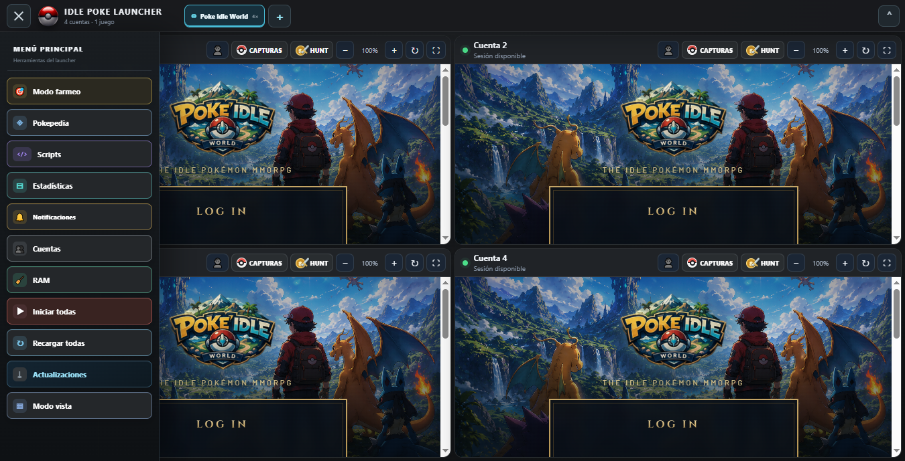
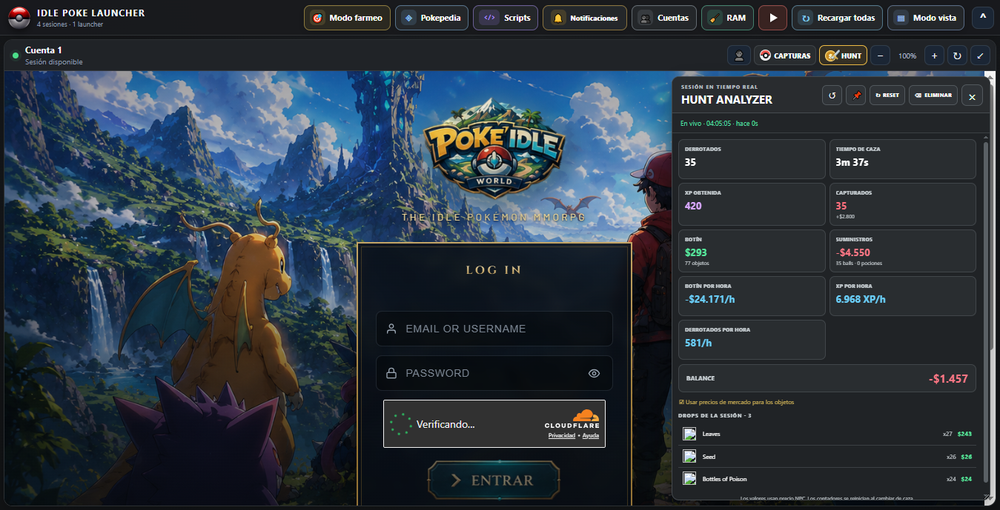
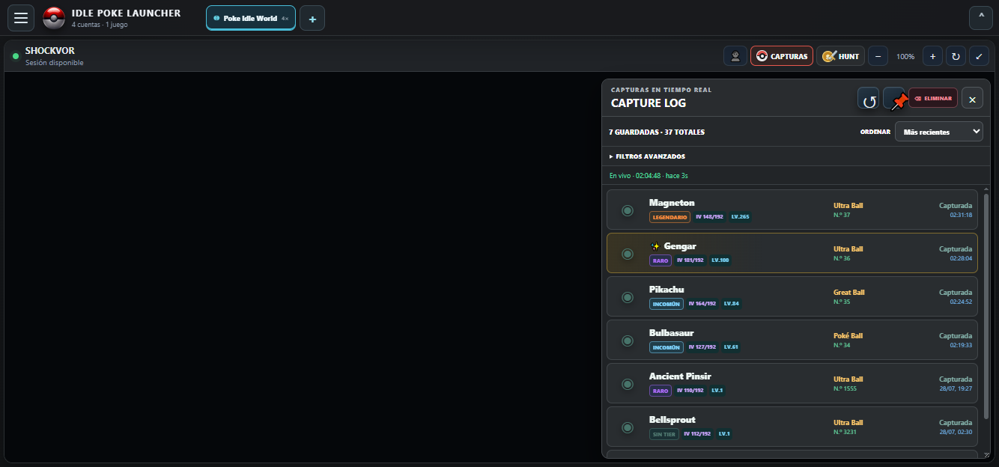
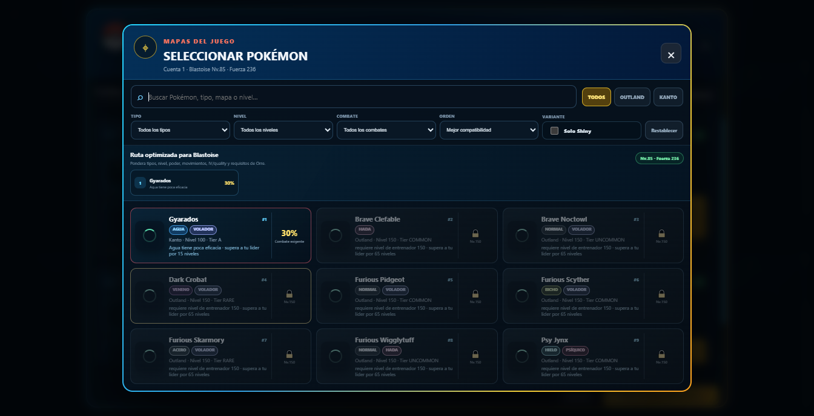

# IDLE POKE LAUNCHER

Launcher de escritorio para Windows diseñado para jugar **Poke Idle World con varias cuentas independientes** y mantener herramientas de seguimiento, administración y navegación en una sola aplicación.

[](https://github.com/DiegoT34/PokeGrid-Launcher/releases/latest)
[](https://github.com/DiegoT34/PokeGrid-Launcher/releases)
[](https://github.com/DiegoT34/PokeGrid-Launcher/releases/latest)

> Proyecto independiente. PokeGrid Launcher no está afiliado con Pokémon, Nintendo, Game Freak ni Poke Idle World.

## Descargar

1. Abre la [última versión publicada](https://github.com/DiegoT34/PokeGrid-Launcher/releases/latest).
2. Descarga `IDLE-POKE-LAUNCHER-x.y.z-portatil.zip`.
3. Descomprime el ZIP en una carpeta con permisos de escritura.
4. Ejecuta `IDLE POKE LAUNCHER.exe`.

No necesita instalador. Las cuentas, sesiones y preferencias se guardan en el perfil de usuario de Windows, fuera de la carpeta del programa.



## Funciones principales

- Cuatro sesiones independientes de Poke Idle World en cuadrícula, con cookies y almacenamiento separados.
- Instancias adicionales para abrir otros juegos web sin cerrar Poke Idle World.
- Elección de una a seis pantallas por instancia adicional.
- Barra superior ocultable y menú lateral desplegable.
- Zoom y expansión individual de cada cuenta.
- Inicio, recarga escalonada y recuperación de conexiones por cuenta.
- Credenciales cifradas con la protección de Windows mediante Electron `safeStorage`.
- Hunt Analyzer individual, Capture Log y estadísticas generales multicuentas.
- Comparación de hunts con clasificación por rendimiento.
- Modo farmeo con selección asistida de objetivos.
- Pokédex en ventana independiente.
- Centro de userscripts multijuego con editor, permisos, instalación por URL, importación y arrastrar/soltar.
- Detección automática por `@match`/`@include`: cada script se aplica y actualiza en las pantallas compatibles de su instancia, mientras Poke Idle World conserva la selección individual por cuenta.
- Etiquetas de juego inferidas por dominio o declaradas con la directiva opcional `@game`.
- Shop online de scripts con información, instalación, actualización, desinstalación y verificación SHA-256.
- Limpieza segura de cachés visuales sin cerrar sesiones ni forzar el recolector de Chromium.
- Actualizador integrado que guarda el paquete verificado en Descargas, confirma el arranque de la versión nueva y restaura la anterior si algo falla.

## Hunt Analyzer

Muestra derrotados, tiempo, experiencia, capturas, botín, suministros, rendimiento por hora, balance y drops de la sesión. Cada cuenta conserva su propio panel flotante.



## Capture Log

Mantiene el historial de capturas por cuenta con IV, Quality/Tier, nivel, Poké Ball, fecha, filtros y detalle individual.



## Modo farmeo

Analiza el Pokémon líder detectado, nivel, tipos, mapas y compatibilidad para organizar objetivos disponibles por cuenta.



## Actualizaciones automáticas

El menú lateral incluye **Actualizaciones**. Al pulsarlo:

1. Consulta la Release estable más reciente de este repositorio.
2. Compara la versión instalada.
3. Descarga el ZIP cuando existe una versión superior.
4. Verifica su archivo `.sha256` antes de ejecutarlo.
5. Cierra el launcher, sustituye la versión anterior y abre la nueva.
6. Si la nueva versión no puede iniciar, restaura automáticamente la anterior.

Consulta [cómo funcionan las actualizaciones](docs/ACTUALIZACIONES.md), la [guía completa de funciones](docs/FUNCIONES.md) y [cómo publicar scripts en la Shop](docs/SCRIPT_SHOP.md).

## Desarrollo

Requisitos: Windows, Node.js 22 o superior y pnpm.

```powershell
pnpm install
pnpm check
pnpm test:updater
pnpm start
```

Para generar el ZIP portátil:

```powershell
pnpm dist
```

El resultado se crea en `dist/`. Los scripts personales que se encuentren junto al proyecto no forman parte del repositorio ni de las Releases.

## Privacidad y seguridad

- Las contraseñas no se publican ni se incluyen en los paquetes.
- Cada cuenta usa una partición persistente independiente.
- El actualizador solo acepta Releases de `DiegoT34/PokeGrid-Launcher` y exige SHA-256.
- Los enlaces externos se abren fuera de los paneles del juego.
- No se incluye telemetría propia del launcher.

Consulta [SECURITY.md](SECURITY.md) para informar problemas de seguridad.

## Licencia

Código del launcher publicado bajo la licencia [MIT](LICENSE).
