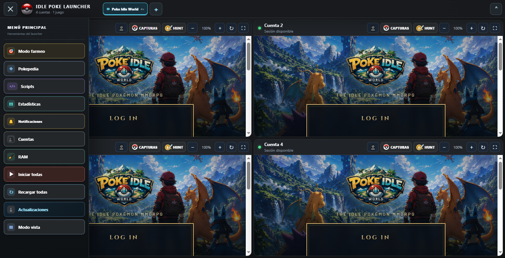
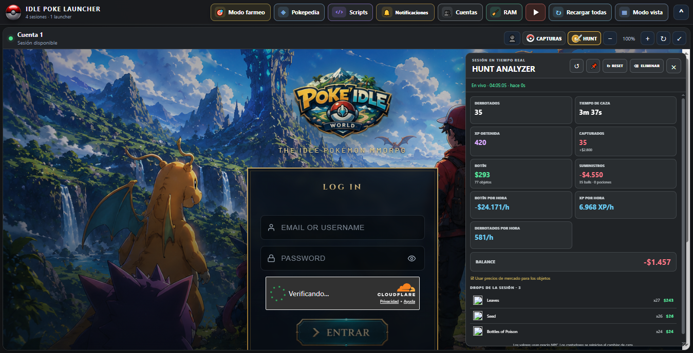
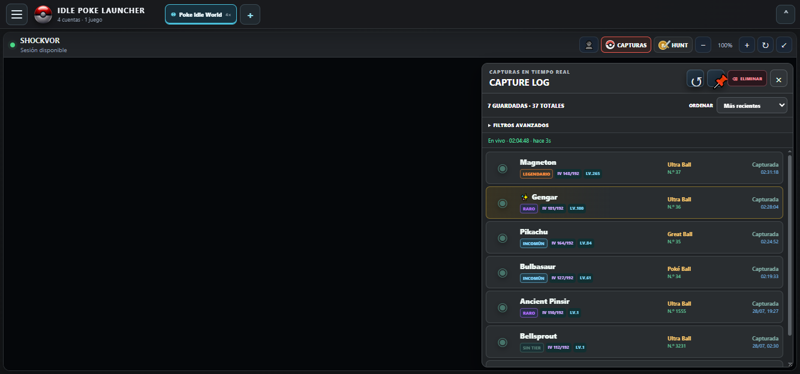
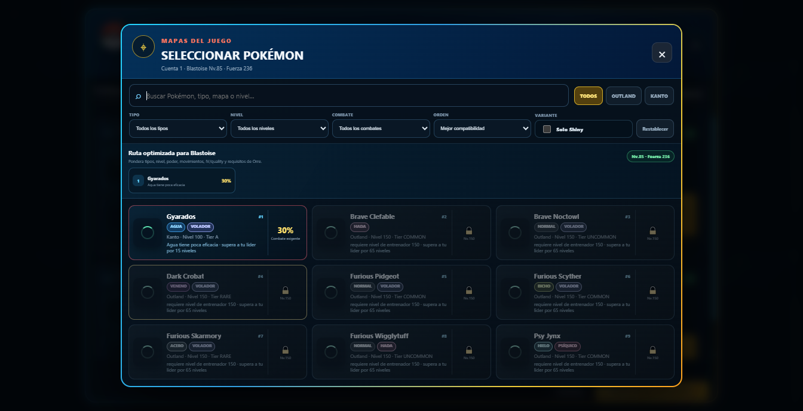

# IDLE POKE LAUNCHER

Launcher portátil para Windows diseñado para administrar **Poke Idle World y otros juegos de navegador** con sesiones independientes, herramientas de seguimiento en tiempo real, userscripts multijuego y actualización automática.

[](https://github.com/DiegoT34/PokeGrid-Launcher/releases/latest)
[](https://github.com/DiegoT34/PokeGrid-Launcher/releases)
[](https://github.com/DiegoT34/PokeGrid-Launcher/releases/latest)

> Proyecto independiente. PokeGrid Launcher no está afiliado con Pokémon, Nintendo, Game Freak ni Poke Idle World.

## Descargar

1. Abre la [última versión publicada](https://github.com/DiegoT34/PokeGrid-Launcher/releases/latest).
2. Descarga `IDLE-POKE-LAUNCHER-x.y.z-portatil.zip`.
3. Descomprime el ZIP en una carpeta con permisos de escritura.
4. Ejecuta `IDLE POKE LAUNCHER.exe`.

No necesita instalador. Las cuentas, sesiones y preferencias se guardan en el perfil de usuario de Windows, fuera de la carpeta del programa.



## Funciones principales

- De una a treinta y dos cuentas simultáneas de Poke Idle World en cuadrícula, con cookies, almacenamiento y conexión separados por cuenta.
- Cuentas ilimitadas (1–32): añadir, eliminar y reordenar desde el modal **Cuentas**, conservando la sesión de cada una.
- Pestañas de instancias para abrir otros juegos web sin cerrar las sesiones existentes.
- De una a seis pantallas independientes por cada instancia adicional, con restauración automática al iniciar.
- Menú lateral flotante con botones flat diferenciados; se superpone sin reducir ni desplazar las ventanas del juego.
- Barra superior ocultable, selector de paneles visibles, zoom y expansión individual por cuenta.
- Inicio conjunto, recarga escalonada, diagnóstico y recuperación de conexiones por pantalla.
- Credenciales cifradas con la protección de Windows mediante Electron `safeStorage`.
- Datos de perfil en tiempo real, Hunt Analyzer individual, Capture Log y estadísticas generales multicuentas.
- Comparación de hunts ordenada por rendimiento, con colores independientes para cada cuenta.
- Modo farmeo con filtros por nombre, región, tipo, nivel, combate y variante shiny.
- Pokédex en ventana independiente.
- Centro de userscripts multijuego con editor, permisos, instalación por URL, importación y arrastrar/soltar.
- Detección automática por `@match`/`@include`: cada script se instala, actualiza y recarga en las pantallas compatibles de su juego.
- Etiquetas de juego inferidas por dominio o declaradas con la directiva opcional `@game`.
- Shop online con catálogo actualizado desde GitHub, información, instalación, actualización, desinstalación y verificación SHA-256.
- Limpieza segura de cachés visuales sin cerrar sesiones ni forzar el recolector de Chromium.
- Actualizador integrado que guarda ZIP y firma en Descargas, reintenta el arranque, confirma la ventana nueva y restaura la versión anterior si algo falla.

## Cuentas ilimitadas y VPN/IP por cuenta

El launcher admite de **1 a 32 cuentas** en la misma instalación. Desde el modal **Cuentas** puedes añadir, eliminar o reordenar perfiles; cada uno conserva su partición persistente (cookies, almacenamiento y sesión) aunque se añadan o eliminen otras cuentas.

Cada cuenta puede usar una **IP/VPN distinta**: protocolo `http` o `socks5`, host, puerto y usuario/clave opcionales. El proxy solo afecta a la sesión de esa cuenta; las demás siguen con su conexión normal. Funciona con cualquier proxy compatible (V2RayN, Clash Verge, proxies residenciales de pago, etc.).

Para usar VPN gratuita sin coste mensual, una opción práctica es [V2RayN](https://github.com/2dust/v2rayN) o [Clash Verge](https://github.com/clash-verge-rev/clash-verge-rev) con nodos gratuitos: habilita un puerto local (mixed/socks/http) por cuenta y escribe ese host/puerto en la fila de cada cuenta. Consulta la [guía completa](docs/FUNCIONES.md#administración-de-cuentas).

> **Atajo:** el script [`scripts/vpn-per-account.cjs`](scripts/vpn-per-account.cjs) levanta automáticamente una instancia v2ray por nodo con su propio puerto local (`node scripts/vpn-per-account.cjs up --count 3`). Guía paso a paso en [docs/VPN-POR-CUENTA.md](docs/VPN-POR-CUENTA.md).

> **Nota:** al eliminar una cuenta, las siguientes heredan su posición; el historial asociado a esa posición (capturas, metas) pasa a la cuenta que ocupa ese lugar.

## Hunt Analyzer

Muestra derrotados, tiempo, experiencia, capturas, botín, suministros, rendimiento por hora, balance y drops de la sesión. Cada cuenta conserva su propio panel flotante.



## Capture Log

Mantiene el historial de capturas por cuenta con IV, Quality/Tier, nivel, Poké Ball, fecha, filtros y detalle individual.



## Modo farmeo

Analiza el Pokémon líder detectado, nivel, tipos, mapas y compatibilidad para organizar objetivos disponibles por cuenta.



## Actualizaciones automáticas

El menú lateral incluye **Actualizaciones**. Al pulsarlo:

1. Consulta la Release estable más reciente de este repositorio.
2. Compara la versión instalada.
3. Descarga el ZIP cuando existe una versión superior y lo conserva en **Descargas**.
4. Verifica su archivo `.sha256` antes de descomprimirlo.
5. Cierra el launcher y abre la nueva versión en una carpeta portátil independiente.
6. Confirma que la nueva ventana está preparada antes de retirar la versión anterior.
7. Si el arranque no se confirma, reintenta y restaura automáticamente la versión anterior.

Consulta [cómo funcionan las actualizaciones](docs/ACTUALIZACIONES.md), la [guía completa de funciones](docs/FUNCIONES.md) y [cómo publicar scripts en la Shop](docs/SCRIPT_SHOP.md).

## Desarrollo

Requisitos: Windows, Node.js 22 o superior y pnpm.

```powershell
pnpm install
pnpm check
pnpm test:updater
pnpm start
```

Para generar el ZIP portátil:

```powershell
pnpm dist
```

El resultado se crea en `dist/`. Los scripts personales que se encuentren junto al proyecto no forman parte del repositorio ni de las Releases.

## Privacidad y seguridad

- Las contraseñas no se publican ni se incluyen en los paquetes.
- Cada cuenta usa una partición persistente independiente.
- El actualizador solo acepta Releases de `DiegoT34/PokeGrid-Launcher` y exige SHA-256.
- Los enlaces externos se abren fuera de los paneles del juego.
- No se incluye telemetría propia del launcher.

Consulta [SECURITY.md](SECURITY.md) para informar problemas de seguridad.

## Licencia

Código del launcher publicado bajo la licencia [MIT](LICENSE).

## Créditos

Creado y mantenido por **[DiegoT34](https://github.com/DiegoT34)**, autor y responsable principal de PokeGrid Launcher.
